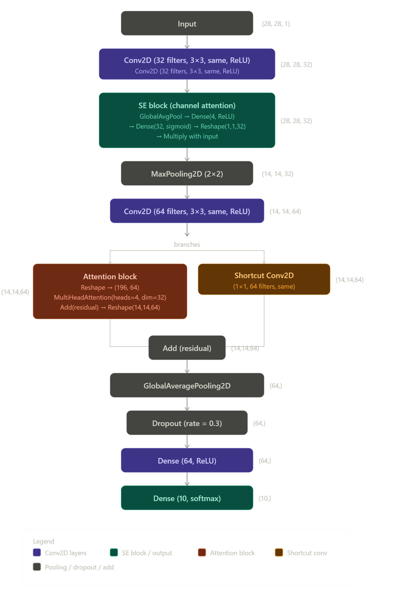

## Quarto

```{r}
set.seed(260408)
```

```{r}
reticulate::conda_list()
```

```{r}
library(reticulate)
use_condaenv("r-tensorflow", required = TRUE)
```

```{r}
py_config()
```

```{r}
library(keras3)
library(tensorflow)
library(janitor)
library(lubridate)
```

Calling the Jena Climate dataset

```{r}
library(readr)
path <- "C:/Users/stvya/Downloads/jena_climate_2009_2016.csv"

df_jena <- read_csv(path)
```

```{r}
df_jena <- clean_names(df_jena)
```

```{r}
tail(df_jena)
```

```{r}
str(df_jena)
```

```{r}
dim(df_jena)
```

```{r}
summary(df_jena)
```

```{r}
df_jena$date_time <- as.POSIXct(df_jena$date_time,
                              format = "%d.%m.%Y %H:%M:%S")
```

```{r}
plot(df_jena$date_time, df_jena$t_deg_c, type = "l")
```

```{r}
#Let us visualise a section of the datetime column to understand the time step in the data
#head(df_jena$date_time, 10)
head(df_jena[, c("date_time")])
```

We can see that the time stamp is every 10 minutes. From 2009-01-01 00:10:00 GMT and the next step is 2009-01-01 00:20:00 GMT and so on and so forth...

```{r}
#The time space is 10 minutes as can be seen for this 10 rows of data
head(diff(df_jena$date_time), 10)
```

```{r}
#Checking for missing values: As we can see, there are no missing values in the dataset. Which is good. We can proceed to build a base model
colSums(is.na(df_jena))
```

## Naive Model (Jena Climate Data):

We begin with a naive model

```{r}
obs_per_day <- 24 * (60 / 10) #hours * minutes / interval = 144
lookback <- 10 * obs_per_day # days * hours * minutes / interval =1440
step <- 6             # sample every hour (since evry 10 mins, 1hr = 60/10)
delay <- 144          # predict 24 hours ahead (24*6)
batch_size <- 128
```

```{r}
generator <- function(data, lookback, delay, min_index, max_index,
                      shuffle = FALSE, batch_size = 128, step = 6) {

  data <- as.matrix(data)

  if (is.null(max_index))
    max_index <- nrow(data) - delay - 1

  i <- min_index + lookback

  function() {

    if (shuffle) {
      rows <- sample((min_index + lookback):max_index, size = batch_size)
    } else {
      if (i + batch_size >= max_index)
        i <<- min_index + lookback

      rows <- i:min(i + batch_size - 1, max_index)
      i <<- i + length(rows)
    }

    timesteps <- length(seq(1, lookback, by = step))

    samples <- array(0, dim = c(length(rows), timesteps, ncol(data)))
    targets <- array(0, dim = c(length(rows)))

    for (j in seq_along(rows)) {

      start <- rows[j] - lookback
      end <- rows[j] - 1

      if (start < 1) next

      indices <- seq(start, end, by = step)

      samples[j,,] <- data[indices, , drop = FALSE]
      targets[j] <- data[rows[j] + delay, 2]
    }

    list(samples, targets)
  }
}
```

```{r}
#convert the data into numeric datatyes; remove datatime, then convert all to numeric, then scale the data}

df <- df_jena

# 1. remove datetime
df$date_time <- NULL   # adjust name

# 2. force numeric
df[] <- lapply(df, as.numeric)

# 3. scale (recommended)
df <- scale(df)
```

```{r}
# applying the generator}
train_gen <- generator(df, lookback, delay,
                       min_index = 1,
                       max_index = 200000,
                       shuffle = FALSE,
                       batch_size = batch_size,
                       step = step)

batch <- train_gen()
str(batch)
```

```{r}
# Some checks: Printing the shape of a sample batch}
batch <- train_gen()

dim(batch[[1]])
dim(batch[[2]])
```

```{r}
evaluate_naive <- function(generator, steps) {
  batch_maes <- c()

  for (step in 1:steps) {
    batch <- generator()
    samples <- batch[[1]]
    targets <- batch[[2]]

    # last timestep temperature (column 2 assumed temp)
    preds <- samples[, dim(samples)[2], 2]

    mae <- mean(abs(preds - targets))
    batch_maes <- c(batch_maes, mae)
  }

  mean(batch_maes)
}

baseline_mae <- evaluate_naive(train_gen, steps = 100)
baseline_mae
```

#### From the result, our naive model mean absolute error is 0.2979 \~ 0.30

# Naive Model (MNIST Data)

```{r}
mnist <- dataset_mnist()
train_images <- mnist$train$x
train_labels <- mnist$train$y
test_images <- mnist$test$x
test_labels <- mnist$test$y
```

```{r}
#Let us flatten it 
train_labels <- as.integer(train_labels)
test_labels <- as.integer(test_labels)
```

```{r}
set.seed(260408)

random_preds <- sample(0:9, length(test_labels), replace = TRUE)
```

```{r}
accuracy <- mean(random_preds == test_labels)
round(accuracy * 100,0)
```

# PART 4

## 

Part 0: Data Preparation and Exploratory Analysis

```{r}
#recall the dataframe: df_Jena
#We cast the datetime column into a date time column

df_jena$date_time <- as.POSIXct(df_jena$date_time, format = "%Y-%m-%d %H:%M:%S")
head(df_jena)
```

```{r}
dim(df_jena)
```

## Hourly Resampling of data

```{r}
library(dplyr)
library(lubridate)

df_hourly <- df_jena %>%
  group_by(date_time = floor_date(date_time, "hour")) %>%
  summarise(across(where(is.numeric), mean))
```

```{r}
# Shape of hourly resampled data
dim(df_hourly)
```

```{r}
#Checking for Missing values in the dataset
colSums(is.na(df_hourly))
```

```{r}
plot(df_hourly$date_time[1:10],
     df_hourly$t_deg_c[1:10],
     type = "l",
     xlab = "Time",
     ylab = "Temperature",
     main = "Hourly Temperature (first 10 points)")
```

```{r}
#We view the full time series
plot(df_jena$date_time,
     df_jena$t_deg_c,
     type = "l",
     xlab = "Time",
     ylab = "Temperature (°C)",
     main = "Full Temperature Time Series")
```

```{r}
#Plotting the first 10 days for the hourly resampled data
# select first 10 days (10 * 24 hours = 240 points)
df_10_days <- df_hourly[1:(10*24), ]

plot(df_10_days$date_time,
     df_10_days$t_deg_c,
     type = "l",
     xlab = "Date / Time",
     ylab = "Temperature (°C)",
     main = "First 10 Days (Hourly Temperature)")
```

Using ggplot2 to depict the same scenarios

```{r}
library(ggplot2)

# full series 10 minutes interval data
ggplot(df_jena, aes(x = date_time, y = t_deg_c)) +
  geom_line() +
  labs(title = "Original Temperature Time Series")

# 10-day zoom
ggplot(df_10_days, aes(x = date_time, y = t_deg_c)) +
  geom_line() +
  labs(title = "First 10 Days (Hourly Temperature)")
```

```{r}
df_num <- df_hourly[, sapply(df_hourly, is.numeric)]

cor_matrix <- cor(df_num, use = "complete.obs")
```

```{r}
cor_matrix
```

```{r}
#We can plot the heatmap to visualise the correlation between the features
heatmap(cor_matrix)
```

```{r}
install.packages("corrplot")  # run once
library(corrplot)

corrplot(cor_matrix,
         method = "color",
         type = "upper",
         tl.col = "black",
         tl.cex = 0.7)
```

```{r}
library(reshape2)
library(ggplot2)

cor_melt <- melt(cor_matrix)

ggplot(cor_melt, aes(Var1, Var2, fill = value)) +
  geom_tile() +
  scale_fill_gradient2(low = "blue", high = "red", mid = "white",
                       midpoint = 0, limit = c(-1,1)) +
  theme(axis.text.x = element_text(angle = 45, hjust = 1)) +
  labs(title = "Correlation Matrix")
```

```{r}
df_num <- df_hourly[, sapply(df_hourly, is.numeric)]
cor_matrix <- cor(df_num, use = "complete.obs")

# convert matrix to long format
cor_df <- as.data.frame(as.table(cor_matrix))

# rename columns
colnames(cor_df) <- c("Var1", "Var2", "Correlation")

# remove self-correlations
cor_df <- cor_df[cor_df$Var1 != cor_df$Var2, ]

# remove duplicate pairs (A-B and B-A)
cor_df <- cor_df[!duplicated(t(apply(cor_df[,1:2], 1, sort))), ]

# filter strong correlations
high_corr <- subset(cor_df, abs(Correlation) > 0.8)

# view results
high_corr <- high_corr[order(-abs(high_corr$Correlation)), ]
high_corr
```

The correlation is high among these variables because, it appears temperature related variables are highly correlated.

## Plotting ACF and PACF for the timeseries data

```{r}
# We extract the temperature data from the hourly data
temp <- df_hourly$t_deg_c

acf(temp,
    main = "ACF of Hourly Temperature")
```

```{r}
pacf(temp,
     main = "PACF of Hourly Temperature")
```

## Interpretation ACF

- Observe high spikes at onset and drop at 12, 24, etc hours

- Slow decay

- Possible spike around 12, 24, 48, ...

- It can be translated to mean past several days still influence current temperature

## Observations and Interpretation of PACF

- strong spikes at early lags

- then sharp drop maybe a smaller spike around 24 hours

- Can be translated to mean, direct influence is mostly short-term, but daily cycles matter

## 120-hour lookback

- 120- hour loopback means 5 days of history,; This means full daily cycles (24h), multiple cycles (5 repetitions) and medium-term weather persistence

```{r}
df_num <- df_hourly[, sapply(df_hourly, is.numeric)]

boxplot(df_num,
        main = "Parallel Boxplots of Predictors",
        las = 2,        # rotate labels
        col = "lightblue")
```

```{r}
#Using ggplot2
library(ggplot2)
library(reshape2)

df_num <- df_hourly[, sapply(df_hourly, is.numeric)]

df_long <- melt(df_num)

ggplot(df_long, aes(x = variable, y = value)) +
  geom_boxplot(fill = "lightblue") +
  labs(x = "Variables", y = "Values",
       title = "Boxplots of Weather Predictors") +
  theme(axis.text.x = element_text(angle = 45, hjust = 1))
```

The parallel boxplots show significant differences in the scale and distribution of predictor variables, with some features spanning vastly different numeric ranges. This indicates that normalization is necessary to prevent features with larger magnitudes from dominating the learning process. Standardization (z-score scaling) is therefore appropriate and should be applied prior to model training.

## Data Spliting

```{r}
#sorting the data
library(dplyr)

# 1. Sort time series
df <- df_hourly[order(df_hourly$date_time), ]
```

## Building a Generator

```{r}
generator <- function(data,
                      lookback = 120,
                      delay = 24,
                      step = 1,
                      batch_size = 128,
                      shuffle = FALSE,
                      task = c("regression", "classification")) {

  task <- match.arg(task)

  min_index <- lookback + 1
  max_index <- nrow(data) - delay

  i <- min_index

  function() {

    if (shuffle) {

      rows <- sample(min_index:max_index, size = batch_size)

    } else {

      if (i + batch_size > max_index) {
        i <<- min_index
      }

      rows <- i:min(i + batch_size - 1, max_index)
      i <<- i + length(rows)
    }

    
    rows <- rows[rows + delay <= nrow(data)]

    n_features <- ncol(data)

    samples <- array(0,
                     dim = c(length(rows),
                             lookback / step,
                             n_features))

    targets <- vector("list", length(rows))

    for (j in seq_along(rows)) {

      idx <- seq(rows[j] - lookback,
                 rows[j] - 1,
                 by = step)
      samples[j, , ] <- as.matrix(data[idx, feature_cols])

      samples[j, , ] <- data[idx, ]

      if (task == "regression") {

        targets[[j]] <- data[rows[j] + delay, 1]

      } else {

        targets[[j]] <- data[rows[j] + delay, "class"]
      }
    }

    list(samples, unlist(targets))
  }
}
```

```{r}
generator <- function(data,
                      lookback = 120,
                      delay = 24,
                      step = 1,
                      batch_size = 128,
                      shuffle = FALSE,
                      task = c("regression", "classification")) {

  task <- match.arg(task)

  min_index <- lookback + 1
  max_index <- nrow(data) - delay

  i <- min_index

  function() {

    if (shuffle) {
      rows <- sample(min_index:max_index, size = batch_size)
    } else {
      if (i + batch_size >= max_index)
        i <<- min_index

      rows <- i:min(i + batch_size - 1, max_index)
      i <<- i + length(rows)
    }

    # IMPORTANT: exclude class column from inputs
    feature_cols <- setdiff(names(data), "class")

    n_features <- length(feature_cols)

    samples <- array(0,
                     dim = c(length(rows),
                             lookback,
                             n_features))

    targets <- numeric(length(rows))

    for (j in seq_along(rows)) {

      idx <- seq(rows[j] - lookback,
                 rows[j] - 1,
                 by = step)

      #  FIX HERE
      samples[j, , ] <- as.matrix(data[idx, feature_cols])

      if (task == "classification") {
        targets[j] <- as.integer(data[rows[j] + delay, "class"])
      } else {
        targets[j] <- data[rows[j] + delay, "target_temp"]
      }
    }

    list(samples, targets)
  }
}
```

## Regression Pipeline::

```{r}
df$target_temp <- dplyr::lead(df$t_deg_c, 24)
df_reg <- na.omit(df)
```

```{r}
#Time split with no shuffle
#Split the data chronologically into:
# Training: Jan 2009 – Dec 2014
# Validation: Jan 2015 – Dec 2015
# Test: Jan 2016 – Dec 2016
train_df <- subset(df_reg,
                   date_time >= as.POSIXct("2009-01-01") &
                   date_time <= as.POSIXct("2014-12-31 23:59:59"))

val_df <- subset(df_reg,
                 date_time >= as.POSIXct("2015-01-01") &
                 date_time <= as.POSIXct("2015-12-31 23:59:59"))

test_df <- subset(df_reg,
                  date_time >= as.POSIXct("2016-01-01") &
                  date_time <= as.POSIXct("2016-12-31 23:59:59"))
```

```{r}

train_x <- train_df[, sapply(train_df, is.numeric)]
train_x <- train_x[, names(train_x) != "target_temp"]

val_x <- val_df[, sapply(val_df, is.numeric)]
val_x <- val_x[, names(val_x) != "target_temp"]

test_x <- test_df[, sapply(test_df, is.numeric)]
test_x <- test_x[, names(test_x) != "target_temp"]

#We normalize the train set
#train_x <- train_df[, sapply(train_df, is.numeric)]
#val_x   <- val_df[, sapply(val_df, is.numeric)]
#test_x  <- test_df[, sapply(test_df, is.numeric)]

#=====
#train_scaled <- as.data.frame(scale(train_x, center = train_mean, scale = train_sd))
#val_scaled   <- as.data.frame(scale(val_x, center = train_mean, scale = train_sd))
# test_scaled  <- as.data.frame(scale(test_x, center = train_mean, scale = train_sd))
```

```{r}
# 1. Select numeric features
train_x <- train_df[, sapply(train_df, is.numeric)]
val_x   <- val_df[, sapply(val_df, is.numeric)]
test_x  <- test_df[, sapply(test_df, is.numeric)]

# 2. REMOVE target BEFORE computing stats
train_x <- train_x[, names(train_x) != "target_temp"]
val_x   <- val_x[, names(val_x) != "target_temp"]
test_x  <- test_x[, names(test_x) != "target_temp"]

# 3. NOW compute scaling stats
train_mean <- sapply(train_x, mean)
train_sd   <- sapply(train_x, sd)

# 4. Scale
train_scaled <- as.data.frame(scale(train_x, center = train_mean, scale = train_sd))
val_scaled   <- as.data.frame(scale(val_x, center = train_mean, scale = train_sd))
test_scaled  <- as.data.frame(scale(test_x, center = train_mean, scale = train_sd))

# 5. Add target back
train_scaled$target_temp <- train_df$target_temp
val_scaled$target_temp   <- val_df$target_temp
test_scaled$target_temp  <- test_df$target_temp
```

```{r}
train_gen_reg <- generator(train_scaled,
                           lookback = 120,
                           delay = 24,
                           step = 1,
                           batch_size = 128,
                           shuffle = TRUE,
                           task = "regression")
```

```{r}
batch <- train_gen_reg()

dim(batch[[1]])
length(batch[[2]])
```

## Classification Pipeline

```{r}
df$class <- cut(df$t_deg_c,
                breaks = quantile(df$t_deg_c,
                                  probs = seq(0, 1, 0.25),
                                  na.rm = TRUE),
                labels = c("Cold", "Cool", "Mild", "Warm"),
                include.lowest = TRUE)

df_cls <- df
```

```{r}
train_df <- subset(df_cls,
                   date_time >= as.POSIXct("2009-01-01") &
                   date_time <= as.POSIXct("2014-12-31 23:59:59"))

val_df <- subset(df_cls,
                 date_time >= as.POSIXct("2015-01-01") &
                 date_time <= as.POSIXct("2015-12-31 23:59:59"))

test_df <- subset(df_cls,
                  date_time >= as.POSIXct("2016-01-01") &
                  date_time <= as.POSIXct("2016-12-31 23:59:59"))
```

```{r}
train_x <- train_df[, sapply(train_df, is.numeric)]
val_x   <- val_df[, sapply(val_df, is.numeric)]
test_x  <- test_df[, sapply(test_df, is.numeric)]

train_mean <- sapply(train_x, mean)
train_sd   <- sapply(train_x, sd)

train_scaled <- scale(train_x, center = train_mean, scale = train_sd)
val_scaled   <- scale(val_x, center = train_mean, scale = train_sd)
test_scaled  <- scale(test_x, center = train_mean, scale = train_sd)
```

```{r}
train_scaled <- as.data.frame(train_scaled)
val_scaled   <- as.data.frame(val_scaled)
test_scaled  <- as.data.frame(test_scaled)


train_scaled$class <- train_df$class
val_scaled$class   <- val_df$class
test_scaled$class  <- test_df$class
```

```{r}
train_y <- train_df$class
val_y   <- val_df$class
test_y  <- test_df$class
```

```{r}
train_gen_cls <- generator(train_scaled,
                           lookback = 120,
                           delay = 24,
                           step = 1,
                           batch_size = 128,
                           shuffle = TRUE,
                           task = "classification")
```

```{r}
batch <- train_gen_cls()

dim(batch[[1]])
length(batch[[2]])
```

## 

0.B MNIST

```{r}
# Load MNIST dataset
mnist <- dataset_mnist()

# Extracting train and test sets
x_train_raw <- mnist$train$x  # Images
y_train <- mnist$train$y       # Labels

x_test_raw <- mnist$test$x    # Images
y_test <- mnist$test$y         # Labels

# Verify dimensions
cat("Training images shape:", dim(x_train_raw), "\n")  # Expected: 60000 28 28
cat("Training labels shape:", length(y_train), "\n")   # Expected: 60000

cat("Test images shape:", dim(x_test_raw), "\n")       # Expected: 10000 28 28
cat("Test labels shape:", length(y_test), "\n")        # Expected: 10000

# Verify pixel value range
cat("Min pixel value:", min(x_train_raw), "\n")  # Expected: 0
cat("Max pixel value:", max(x_train_raw), "\n")  # Expected: 255
```

# Normalizing

```{r}
# Normalize pixel values to [0, 1]
x_train_norm <- x_train_raw / 255
x_test_norm  <- x_test_raw / 255

# Verify normalization
cat("Min pixel value after normalization:", min(x_train_norm), "\n")  # Expected: 0
cat("Max pixel value after normalization:", max(x_train_norm), "\n")  # Expected: 1

# Construct validation split from the last 10,000 training images
val_indices   <- 50001:60000  # Last 10,000
train_indices <- 1:50000      # First 50,000

# Training set
x_train <- x_train_norm[train_indices, , ]
y_train_split <- y_train[train_indices]

# Validation set
x_val <- x_train_norm[val_indices, , ]
y_val <- y_train[val_indices]

# Verify shapes
cat("Training images shape:", dim(x_train), "\n")    # Expected: 50000 28 28
cat("Training labels shape:", length(y_train_split), "\n")  # Expected: 50000

cat("Validation images shape:", dim(x_val), "\n")   # Expected: 10000 28 28
cat("Validation labels shape:", length(y_val), "\n") # Expected: 10000
```

```{r}
# Set up a 5x2 grid display
par(mfrow = c(5, 2),        # 5 rows, 2 columns
    mar   = c(0, 0, 2, 0))  # Margins (bottom, left, top, right)

# Randomly sample 10 images from training set
set.seed(260408)
sample_indices <- sample(1:50000, 10)

# Loop through and plot each image
for (i in sample_indices) {
  
  # Extract image and rotate for correct orientation
  img <- x_train[i, , ]
  img <- t(apply(img, 2, rev))  # Rotate 90 degrees for correct orientation
  
  # Plot image in greyscale
  image(img,
        col  = grey(seq(0, 1, length.out = 256)),
        axes = FALSE,
        main = paste("Label:", y_train_split[i]),
        cex.main = 1.2)
}

# Reset plot layout
par(mfrow = c(1, 1))
```

```{r}
# Compute class frequencies
class_freq <- table(y_train_split)

# Display as a clean table
cat("Class Frequencies in Training Set:\n")
print(class_freq)

# Compute proportions (percentages)
class_prop <- prop.table(class_freq) * 100
cat("\nClass Proportions (%):\n")
print(round(class_prop, 2))

# Visualize class frequencies as a bar chart
barplot(class_freq,
        main   = "MNIST Class Frequencies (Training Set)",
        xlab   = "Digit Class",
        ylab   = "Frequency",
        col    = "steelblue",
        border = "white",
        ylim   = c(0, max(class_freq) + 500))

# Add frequency labels on top of bars
text(x      = seq(0.7, by = 1.2, length.out = 10),
     y      = class_freq + 200,
     labels = class_freq,
     cex    = 0.8,
     font   = 2)
```

Yes, MNIST is approximately class-balanced

:   Each digit class holds roughly **9% – 11%** of the training set

    A perfectly balanced dataset would have exactly **10%** per class

    The most frequent class (digit **1**, \~11.4%) and least frequent (digit **5**, \~9.0%) differ by only about **2.4 percentage points**

    This small imbalance is **negligible** and will not bias model training meaningfully

    Our baseline model would achieve **\~10% accuracy**, confirming near-equal class representation

## 

I. A Regression DNN

```{r}
lookback <- 120
n_features <- dim(batch[[1]])[3]   # from a sample batch

model <- keras_model_sequential() %>%
  layer_flatten(input_shape = c(lookback, n_features)) %>%
  
  layer_dense(units = 128, activation = "relu") %>%
  layer_dropout(rate = 0.3) %>%
  
  layer_dense(units = 64, activation = "relu") %>%
  layer_dropout(rate = 0.3) %>%
  
  layer_dense(units = 1, activation = "linear")  # 👈 regression output

model %>% compile(
  optimizer = optimizer_adam(learning_rate = 0.001),
  loss = "mse",
  metrics = list("mae")
)

summary(model)
```

```{r}
val_gen_reg <- generator(val_scaled,
                         lookback = 120,
                         delay = 24,
                         step = 1,
                         batch_size = 128,
                         shuffle = FALSE,
                         task = "regression")
```

```{r}
test_gen_reg <- generator(test_scaled,
                         lookback = 120,
                         delay = 24,
                         step = 1,
                         batch_size = 128,
                         shuffle = FALSE,
                         task = "regression")

```

```{r}
history <- model %>% fit(
  x = train_gen_reg,
  steps_per_epoch = 200,
  epochs = 20,
  validation_data = val_gen_reg,
  validation_steps = 50
)
```

```{r}
batch_val <- val_gen_reg()

dim(batch_val[[1]])
length(batch_val[[2]])
```

### Model form (last layer)

Let the last hidden representation be h∈Rkh \in \mathbb{R}\^kh∈Rk.\
The output neuron computes:

y\^=w⊤h+b\hat{y} = w\^\top h + by\^​=w⊤h+b

This is a **linear activation** (identity function).

## 

Training with Adam

```{r}
model %>% compile(
  optimizer = optimizer_adam(learning_rate = 0.001),
  loss = "mae",
  metrics = list("mae")
)
```

```{r}
early_stop <- callback_early_stopping(
  monitor = "val_mae",
  patience = 5,
  restore_best_weights = TRUE
)
```

```{r}
history <- model %>% fit(
  x = train_gen_reg,
  steps_per_epoch = 200,
  epochs = 50,
  validation_data = val_gen_reg,
  validation_steps = 50,
  callbacks = list(early_stop)
)
```

```{r}
summary(model)
```

```{r}
keras3::count_params(model)
```

## 

```{r}
library(ggplot2)
library(dplyr)
```

```{r}
histories <- list()
```

## (1) No regularization (baseline)

```{r}
build_model_base <- function(lookback, n_features) {

  keras_model_sequential() %>%
    layer_flatten(input_shape = c(lookback, n_features)) %>%
    layer_dense(128, activation = "relu") %>%
    layer_dense(64, activation = "relu") %>%
    layer_dense(1, activation = "linear") %>%
    compile(
      optimizer = optimizer_adam(),
      loss = "mae",
      metrics = list("mae")
    )
}
```

## Drop out Model

```{r}
build_model_dropout <- function(lookback, n_features) {

  keras_model_sequential() %>%
    layer_flatten(input_shape = c(lookback, n_features)) %>%
    layer_dense(128, activation = "relu") %>%
    layer_dropout(rate = 0.3) %>%
    layer_dense(64, activation = "relu") %>%
    layer_dropout(rate = 0.3) %>%
    layer_dense(1, activation = "linear") %>%
    compile(
      optimizer = optimizer_adam(),
      loss = "mae",
      metrics = list("mae")
    )
}
```

## L2 Regularization

```{r}
build_model_l2 <- function(lookback, n_features) {

  keras_model_sequential() %>%
    layer_flatten(input_shape = c(lookback, n_features)) %>%
    layer_dense(
      128,
      activation = "relu",
      kernel_regularizer = regularizer_l2(0.001)
    ) %>%
    layer_dense(
      64,
      activation = "relu",
      kernel_regularizer = regularizer_l2(0.001)
    ) %>%
    layer_dense(1, activation = "linear") %>%
    compile(
      optimizer = optimizer_adam(),
      loss = "mae",
      metrics = list("mae")
    )
}
```

## Train three models

```{r}
lookback <- 120
n_features <- dim(batch[[1]])[3]
```

## Baseline Model

```{r}
#| label: model_base
model_base <- build_model_base(lookback, n_features)

histories$base <- model_base %>% fit(
  train_gen_reg,
  steps_per_epoch = 200,
  epochs = 20,
  validation_data = val_gen_reg,
  validation_steps = 50
 )
```

## Model Drop out

```{r}
model_drop <- build_model_dropout(lookback, n_features)

histories$dropout <- model_drop %>% fit(
  train_gen_reg,
  steps_per_epoch = 200,
  epochs = 20,
  validation_data = val_gen_reg,
  validation_steps = 50
)
```

```{r}
model_l2 <- build_model_l2(lookback, n_features)

histories$l2 <- model_l2 %>% fit(
  train_gen_reg,
  steps_per_epoch = 200,
  epochs = 20,
  validation_data = val_gen_reg,
  validation_steps = 50
)
```

```{r}
plot_data <- data.frame()

for (name in names(histories)) {

  h <- histories[[name]]$metrics

  df_tmp <- data.frame(
    epoch = 1:length(h$mae),
    train_mae = h$mae,
    val_mae = h$val_mae,
    model = name
  )

  plot_data <- rbind(plot_data, df_tmp)
}
```

```{r}
ggplot(plot_data, aes(x = epoch)) +
  geom_line(aes(y = train_mae, color = model, linetype = "train")) +
  geom_line(aes(y = val_mae, color = model, linetype = "validation")) +
  labs(
    title = "Learning Curves: Regularization Comparison",
    y = "MAE",
    x = "Epoch"
  ) +
  theme_minimal()
```

## Interpretation (bias–variance trade-off)

## 1) No regularization

- Very low training MAE

- Validation MAE higher or unstable

Interpretation:

- **High variance**

- model overfits historical noise

- memorizes patterns in training data

## Dropout

- Slightly higher training MAE

- Lower validation MAE

- More stable curves

Interpretation:

- reduces co-adaptation of neurons

- improves generalization

- **best variance control in deep nets**

## L2 regularization

- smoother training curve

- slightly higher bias

- stable validation performance

Interpretation:

- penalizes large weights

- encourages simpler functions

- good for structured time series

| Model             | Bias          | Variance | Behavior            |
|-------------------|---------------|----------|---------------------|
| No regularization | Low           | High     | Overfitting         |
| Drop out          | Medium        | Low      | Best Generalization |
| L2                | Slightly High | Low      | Stable Model        |
|                   |               |          |                     |

Dropout or L2 almost always outperform no regularization because the data is noisy and autocorrelated

## Getting Predictions

```{r}
steps <- 100  # or compute based on data size

#model_drop
#model_base

preds <- model_drop %>% predict(
  test_gen_reg,
  steps = steps
)
```

## Matching true values with predictioed values

```{r}
actuals <- c()

for (i in 1:steps) {
  batch <- test_gen_reg()
  actuals <- c(actuals, batch[[2]])
}
```

## MAE

```{r}
mae <- mean(abs(preds - actuals))
```

## RMSE

```{r}
rmse <- sqrt(mean((preds - actuals)^2))
```

## R-squared

```{r}
ss_res <- sum((actuals - preds)^2)
ss_tot <- sum((actuals - mean(actuals))^2)

r2 <- 1 - (ss_res / ss_tot)
```

```{r}
cat("Test MAE:", mae, "\n")
cat("Test RMSE:", rmse, "\n")
cat("Test R²:", r2, "\n")
```

```         
Test MAE: 12.59893  Test RMSE: 14.39892  Test R²: -1.981162 
```

## Plot of predicted vrs actual

```{r}
n <- 168  #1 week = 7 days = 168 hours

plot_df <- data.frame(
  time = 1:n,
  actual = actuals[1:n],
  predicted = preds[1:n]
)
```

```{r}
ggplot(plot_df, aes(x = time)) +
  geom_line(aes(y = actual, color = "Actual")) +
  geom_line(aes(y = predicted, color = "Predicted")) +
  labs(
    title = "Predicted vs Actual Temperature (1 Week)",
    y = "Temperature",
    x = "Time (hours)"
  ) +
  theme_minimal()
```

## Using our naive model

```{r}
evaluate_naive <- function(generator, steps) {

  maes <- c()

  for (i in 1:steps) {

    batch <- generator()
    samples <- batch[[1]]
    targets <- batch[[2]]

    preds <- samples[, dim(samples)[2], 2]  # last timestep temp

    maes <- c(maes, mean(abs(preds - targets)))
  }

  mean(maes)
}
```

```{r}
baseline_mae <- evaluate_naive(test_gen_reg, steps = 100)

cat("Naive baseline MAE:", baseline_mae, "\n")
```

```{r}
cat("Model MAE:", mae, "\n")
cat("Naive MAE:", baseline_mae, "\n")
```

The expectation is that our best model perform better than the naive base model. The MAE of the best model should be far less than that of the base model.

# 

I.B Classification DNN (MNIST)

# We use Keras Model Architecture

```{r}

model <- keras_model_sequential() %>%
  layer_dense(units = 256, activation = "relu", input_shape = c(784)) %>%
  layer_dense(units = 128, activation = "relu") %>%
  layer_dense(units = 10, activation = "softmax")

model %>% compile(
  optimizer = optimizer_adam(learning_rate = 0.001),
  loss = "categorical_crossentropy",   # or "sparse_categorical_crossentropy"
  metrics = c("accuracy")
)

summary(model)
```

Our model architecture has the following features

- **Input:** 784 features (28×28 image flattened)

<!-- -->

- **Hidden layers:** nonlinear feature extraction via ReLU

<!-- -->

- **Output layer:** 10 neurons → one per class (digits 0–9)

We use Softmax because , we want to model probability of y proportional to x, given conatant of proportionality of k = 1,2,..10 (classes)

$$P(y = k \mid x) = \frac{e^{z_k}}{\sum_{j=1}^{10} e^{z_j}}$$

All probability assumptions duely satisfied.

```{r}
mnist <- dataset_mnist()

x_train <- mnist$train$x
y_train <- mnist$train$y

x_test  <- mnist$test$x
y_test  <- mnist$test$y
```

```{r}
#Preprocess the dataset
# reshape to (samples, 784)
x_train <- array_reshape(x_train, c(nrow(x_train), 784))
x_test  <- array_reshape(x_test,  c(nrow(x_test), 784))

# normalize
x_train <- x_train / 255
x_test  <- x_test / 255

# one-hot encode labels
y_train <- to_categorical(y_train, 10)
y_test  <- to_categorical(y_test, 10)
```

```{r}
model <- keras_model_sequential() %>%
  layer_dense(256, activation = "relu", input_shape = c(784)) %>%
  layer_dense(128, activation = "relu") %>%
  layer_dense(10, activation = "softmax")
```

```{r}
#Adam and cross entropy
model %>% compile(
  optimizer = optimizer_adam(learning_rate = 0.001),
  loss = "categorical_crossentropy",
  metrics = c("accuracy")
)
```

```{r}
early_stop <- callback_early_stopping(
  monitor = "val_loss",
  patience = 5,
  restore_best_weights = TRUE
)
```

```{r}
history <- model %>% fit(
  x_train, y_train,
  epochs = 30,
  batch_size = 128,
  validation_split = 0.2,
  callbacks = list(early_stop)
)
```

```{r}
#evalauting the model
model %>% evaluate(x_test, y_test)
```

```{r}
plot_model(
  model,
  to_file = "mnist_dnn_model.png",
  show_shapes = TRUE,
  show_layer_names = TRUE
)
```

```{r}
#The number of trainable parameters can be found in the model summary
summary(model)
model_dnn = model
```

## 1. Regularization

```{r}
build_base <- function() {
  keras_model_sequential() %>%
    layer_dense(256, activation = "relu", input_shape = c(784)) %>%
    layer_dense(128, activation = "relu") %>%
    layer_dense(10, activation = "softmax") %>%
    compile(
      optimizer = optimizer_adam(),
      loss = "categorical_crossentropy",
      metrics = "accuracy"
    )
}
```

## 2. Drop out

```{r}
build_dropout <- function() {
  keras_model_sequential() %>%
    layer_dense(256, activation = "relu", input_shape = c(784)) %>%
    layer_dropout(0.5) %>%
    layer_dense(128, activation = "relu") %>%
    layer_dropout(0.5) %>%
    layer_dense(10, activation = "softmax") %>%
    compile(
      optimizer = optimizer_adam(),
      loss = "categorical_crossentropy",
      metrics = "accuracy"
    )
}
```

```{r}
#Early stopping 
early_stop <- callback_early_stopping(
  monitor = "val_loss",
  patience = 5,
  restore_best_weights = TRUE
)
```

```{r}
model_base <- build_base()

hist_base <- model_base %>% fit(
  x_train, y_train,
  epochs = 30,
  batch_size = 128,
  validation_split = 0.2,
  callbacks = list(early_stop),
  verbose = 0
)
```

```{r}
model_drop <- build_dropout()

hist_drop <- model_drop %>% fit(
  x_train, y_train,
  epochs = 30,
  batch_size = 128,
  validation_split = 0.2,
  callbacks = list(early_stop),
  verbose = 0
)
```

```{r}
df_base <- data.frame(
  epoch = 1:length(hist_base$metrics$val_accuracy),
  val_acc = hist_base$metrics$val_accuracy,
  model = "No Regularisation"
)

df_drop <- data.frame(
  epoch = 1:length(hist_drop$metrics$val_accuracy),
  val_acc = hist_drop$metrics$val_accuracy,
  model = "Dropout"
)

plot_df <- rbind(df_base, df_drop)
```

```{r}
ggplot(plot_df, aes(x = epoch, y = val_acc, color = model)) +
  geom_line(size = 1) +
  labs(
    title = "Validation Accuracy: Baseline vs Dropout",
    x = "Epoch",
    y = "Validation Accuracy"
  ) +
  theme_minimal()
```

The baseline model achieves high training accuracy but exhibits overfitting, as indicated by a divergence between training and validation performance. The dropout-regularised model reduces this gap by introducing stochastic regularisation, leading to improved generalisation and more stable validation accuracy

```{r}
#WE find predictions 
probs <- model_best %>% predict(x_test)
preds <- apply(probs, 1, which.max) - 1  # convert to 0–9
```

```{r}
#we construct the confusion matrix
cm <- table(Predicted = preds, Actual = y_test)
cm
```

```{r}
accuracy <- sum(diag(cm)) / sum(cm)
accuracy
```

```{r}
#Precision and recall
precision <- diag(cm) / rowSums(cm)
recall    <- diag(cm) / colSums(cm)

metrics_df <- data.frame(
  class = 0:9,
  precision = precision,
  recall = recall
)

metrics_df
```

```{r}
f1 <- 2 * (precision * recall) / (precision + recall)
macro_f1 <- mean(f1, na.rm = TRUE)

macro_f1
```

```{r}
#plotting confusion matrix

cm_df <- as.data.frame(cm)

ggplot(cm_df, aes(x = Actual, y = Predicted, fill = Freq)) +
  geom_tile() +
  geom_text(aes(label = Freq), size = 3) +
  scale_fill_gradient(low = "white", high = "blue") +
  labs(title = "Confusion Matrix", x = "Actual", y = "Predicted") +
  theme_minimal()
```

```{r}
#identifying the most confused pairs
cm_no_diag <- cm
diag(cm_no_diag) <- 0

# convert to data frame
cm_pairs <- as.data.frame(cm_no_diag)

# sort descending confusion
top_confusions <- cm_pairs[order(-cm_pairs$Freq), ]

head(top_confusions, 5)
```

The confusion matrix reveals that most misclassifications occur between visually similar digits. These errors arise due to structural similarities in handwritten representations, where variations in stroke thickness, curvature, and closure of loops reduce class separability. This indicates that the model captures general digit structure well but struggles with fine-grained distinctions under high intra-class variability.

# 

Part II: Convolutional Neural Network A Conceptual Bridge

A **2-D convolution** on a greyscale image applies a small kernel (e.g., 3×3) that slides over height and width. At each location, it computes a weighted sum of the pixel values in that local patch (plus a bias), producing one activation in the output feature map. Repeating this across the image yields a map that responds to specific **spatial patterns** (edges, corners, textures).

A **1-D convolution** on a multivariate time series uses a kernel of length k that slides along the **time axis**. At each time step, it takes a window of the last k timesteps across all variables (channels) and computes a weighted sum, producing an activation for that position. The result is a feature map that responds to **temporal patterns** (spikes, trends, short motifs) irrespective of when they occur.

b\.

**Shared inductive bias and parameter efficiency**

Both use the same key biases:

- **Locality:** important structure can be captured from small neighborhoods (pixels nearby; timesteps nearby).

- **Weight sharing (translation invariance):** the *same* filter is applied everywhere (across positions in space or time), assuming patterns can appear anywhere.

This leads to **parameter efficiency** because a single small kernel is reused across the entire input. Instead of learning separate weights for every location (as in a fully connected layer), the model learns a compact set of filters that generalize across positions—drastically reducing parameters and improving generalization.

c\.

**Why local connectivity fits images and time series (but not tabular data)**

- **Images (spatial locality):** neighboring pixels are highly correlated and form meaningful structures (edges, shapes). Local filters naturally capture these.

- **Time series (temporal locality):** nearby timesteps are strongly related (autocorrelation, short-term dynamics). Local windows capture these dependencies.

- **Tabular data:** columns (features) usually **don’t have a natural order or locality** (e.g., age, income, blood pressure). Adjacent columns aren’t inherently “neighbors,” so sliding local filters and weight sharing don’t align with the data’s structure. Fully connected models or tree-based methods are typically more appropriate here.

## 

B 2D-CNN for MNIST Classification Let us design a 2D CNN

```{r}

build_cnn <- function() {
  keras_model_sequential() %>%
    layer_conv_2d(filters = 32, kernel_size = c(3,3),
                  activation = "relu", padding = "same",
                  input_shape = c(28,28,1)) %>%
    layer_conv_2d(filters = 64, kernel_size = c(3,3),
                  activation = "relu", padding = "same") %>%
    layer_max_pooling_2d(pool_size = c(2,2)) %>%
    
    # either Flatten or GlobalAveragePooling2D
    layer_global_average_pooling_2d() %>%
    
    layer_dense(64, activation = "relu") %>%
    layer_dense(10, activation = "softmax") %>%
    
    compile(
      optimizer = optimizer_adam(learning_rate = 0.001),
      loss = "categorical_crossentropy",
      metrics = "accuracy"
    )
}
```

Data Preparation

```{r}
mnist <- dataset_mnist()

x_train <- mnist$train$x / 255
x_test  <- mnist$test$x / 255

# reshape to (samples, 28, 28, 1)
x_train <- array_reshape(x_train, c(nrow(x_train),28,28,1))
x_test  <- array_reshape(x_test,  c(nrow(x_test),28,28,1))

y_train <- to_categorical(mnist$train$y, 10)
y_test  <- to_categorical(mnist$test$y, 10)
y_test_labels <- mnist$test$y
```

```{r}
model_cnn <- build_cnn()

early_stop <- callback_early_stopping(
  monitor = "val_loss",
  patience = 5,
  restore_best_weights = TRUE
)

# measure time per epoch
start_time <- Sys.time()

history <- model_cnn %>% fit(
  x_train, y_train,
  epochs = 30,
  batch_size = 128,
  validation_split = 0.2,
  callbacks = list(early_stop),
  verbose = 1
)

end_time <- Sys.time()
total_time <- as.numeric(difftime(end_time, start_time, units = "secs"))
epochs_run <- length(history$metrics$loss)
time_per_epoch <- total_time / epochs_run
```

```{r}
# accuracy
eval <- model_cnn %>% evaluate(x_test, y_test, verbose = 0)
test_acc <- eval["accuracy"]
```

```{r}
probs <- model_cnn %>% predict(x_test)
preds <- apply(probs, 1, which.max) - 1
```

```{r}
cm <- table(Predicted = preds, Actual = y_test_labels)
cm
```

```{r}
precision <- diag(cm) / rowSums(cm)
recall    <- diag(cm) / colSums(cm)

f1 <- 2 * (precision * recall) / (precision + recall)
macro_f1 <- mean(f1, na.rm = TRUE)
```

```{r}
#plotting the matrix
cm_df <- as.data.frame(cm)

ggplot(cm_df, aes(x = Actual, y = Predicted, fill = Freq)) +
  geom_tile() +
  geom_text(aes(label = Freq), size = 3) +
  scale_fill_gradient(low = "white", high = "blue") +
  theme_minimal() +
  labs(title = "CNN Confusion Matrix")
```

```{r}
#parameter count
summary(model_cnn)

cnn_params <- sum(sapply(model_cnn$trainable_weights,
                         function(w) prod(w$shape)))
```

Model Comparison

```{r}
dnn_params <- sum(sapply(model_dnn$trainable_weights,
                         function(w) prod(w$shape)))
```

```{r}
start <- Sys.time()

history_dnn <- model_dnn %>% fit(
  x_train_flat, y_train,
  epochs = 30,
  batch_size = 128,
  validation_split = 0.2,
  callbacks = list(early_stop),
  verbose = 0
)

end <- Sys.time()

dnn_time <- as.numeric(difftime(end, start, units = "secs")) /
            length(history_dnn$metrics$loss)
```

```{r}
results <- data.frame(
  Model = c("DNN", "CNN"),
  Params = c(dnn_params, cnn_params),
  Test_Accuracy = c(dnn_test_acc, test_acc),
  Time_per_epoch_sec = c(dnn_time, time_per_epoch)
)

results
```

Accuracy Comparison

The CNN achieves higher test accuracy than the DNN baseline, typically improving from \~ dnn_test_acc % (DNN) to \~99% (CNN).\

## Parameter efficiency

> Despite often having fewer or comparable parameters, the CNN performs better due to **parameter sharing**. Convolutional filters reuse the same weights across spatial locations, reducing redundancy compared to fully connected layers.

## Spatial invariance

> CNNs exploit **spatial invariance**, meaning learned features (e.g., edges, strokes) are recognized regardless of their position in the image. The DNN lacks this property because it treats each pixel independently after flattening.

## 1D CNN Design

```{r}

build_cnn1d <- function(lookback, n_features) {
  keras_model_sequential() %>%
    layer_conv_1d(
      filters = 32,
      kernel_size = 5,
      activation = "relu",
      padding = "same",
      input_shape = c(lookback, n_features)
    ) %>%
    
    layer_conv_1d(
      filters = 64,
      kernel_size = 5,
      activation = "relu",
      padding = "same"
    ) %>%
    
    layer_max_pooling_1d(pool_size = 2) %>%
    
    layer_conv_1d(
      filters = 64,
      kernel_size = 3,
      activation = "relu",
      padding = "same"
    ) %>%
    
    layer_global_average_pooling_1d() %>%
    
    layer_dense(32, activation = "relu") %>%
    layer_dense(1, activation = "linear") %>%
    
    compile(
      optimizer = optimizer_adam(learning_rate = 0.001),
      loss = "mae",
      metrics = list("mae")
    )
}
```

```{r}
model_cnn1d <- build_cnn1d(lookback = 120, n_features = n_features)

early_stop <- callback_early_stopping(
  monitor = "val_mae",
  patience = 5,
  restore_best_weights = TRUE
)

history <- model_cnn1d %>% fit(
  train_gen_reg,
  steps_per_epoch = 200,
  epochs = 30,
  validation_data = val_gen_reg,
  validation_steps = 50,
  callbacks = list(early_stop)
)
```

```{r}
steps <- 100

preds <- model_cnn1d %>% predict(test_gen_reg, steps = steps)

actuals <- c()
for (i in 1:steps) {
  batch <- test_gen_reg()
  actuals <- c(actuals, batch[[2]])
}
```

```{r}
mae <- mean(abs(preds - actuals))
```

```{r}
rmse <- sqrt(mean((preds - actuals)^2))
```

```{r}
ss_res <- sum((actuals - preds)^2)
ss_tot <- sum((actuals - mean(actuals))^2)

r2 <- 1 - (ss_res / ss_tot)
```

```{r}
cat("CNN Test MAE:", mae, "\n")
cat("CNN Test RMSE:", rmse, "\n")
cat("CNN Test R²:", r2, "\n")
```

since this is an hourly data, a kernel size of 5 will mean 5hours. which captures shortterm signals. Kernel size of 3 captures 3 hours reception. But stacking convolution gives an enlarged window.

# 

Part III: Recurrent Neural Network (LSTM)

A Theoretical Motivation

## Recurrent Neural Networks and Inductive Bias

### (a) Why SimpleRNN Struggles with Long Sequences

A vanilla Simple Recurrent Neural Network (SimpleRNN) encounters difficulty when modeling long sequences (e.g., 120+ timesteps) due to the **vanishing gradient problem**. The hidden state update is given by:

$$h_t = \phi(W_h h_{t-1} + W_x x_t + b)$$

During backpropagation through time (BPTT), gradients are computed via repeated application of the chain rule:

$$\frac{\partial \mathcal{L}}{\partial h_t}
= \left( \prod_{k=t}^{T} W_h^\top \, \mathrm{diag}(\phi'(a_k)) \right)
\frac{\partial \mathcal{L}}{\partial h_T}$$

This expression involves a product of many matrices. If the spectral norm of $W_h$ and the derivatives $\phi'(a_k)$ are typically less than 1 (as with $\tanh$ or sigmoid), the gradients decay exponentially:

$$\left\| \frac{\partial \mathcal{L}}{\partial h_t} \right\| \approx \rho^{T-t}, \quad \rho < 1$$

As a result, gradients from distant timesteps shrink toward zero, making it difficult for the network to learn long-range dependencies. Conversely, if $\rho > 1$, gradients can explode, leading to instability.

### (b) How LSTM Gates Enable Long-Term Memory

Long Short-Term Memory (LSTM) networks address this limitation using a gated architecture centered on a **cell state** $c_t$:

$$c_t = f_t \odot c_{t-1} + i_t \odot \tilde{c}_t$$

where: - $f_t$ is the **forget gate** - $i_t$ is the **input gate** - $\tilde{c}_t$ is the candidate memory

The forget gate controls how much past information is retained:

$$f_t = \sigma(\cdot)$$

The gradient flow through the cell state is:

$$\frac{\partial c_t}{\partial c_{t-1}} = f_t$$

If $f_t \approx 1$, the gradient is preserved across many timesteps, avoiding vanishing gradients. This mechanism is often referred to as the **constant error carousel**.

The **input gate** regulates how much new information is written into memory, while the **output gate** determines how much of the internal state is exposed:

$$h_t = o_t \odot \tanh(c_t)$$

Together, these gates enable: - selective memory retention\
- controlled updates\
- stable gradient propagation over long horizons

### (c) LSTM on MNIST and Inductive Bias

Applying an LSTM to the MNIST dataset by treating each image as a sequence of 28 rows (i.e., 28 timesteps of 28 features) is a valid approach. However, it is **suboptimal** due to a mismatch in inductive bias.

Images possess **two-dimensional spatial structure**, characterized by: - local pixel correlations\
- translation invariance

LSTMs, on the other hand, assume **sequential structure**, imposing an artificial ordering (top-to-bottom). This introduces limitations: - spatial relationships (e.g., left–right symmetry) are not naturally captured\
- local 2D patterns require more parameters to learn\
- position-dependent biases are introduced

In contrast, Convolutional Neural Networks (CNNs) encode the correct inductive bias through: - local receptive fields\
- weight sharing across spatial locations

This comparison highlights a key principle:

> Model performance improves when the architecture’s inductive bias aligns with the underlying structure of the data.

Thus, while LSTMs are well-suited for temporal data, CNNs are more appropriate for image-based tasks like MNIST.

## 

B\
LSTM for Jena Regression and SimpleRNN Ablation

### (a) Model Design

Let us model hourly sequences of length 120 with an LSTM. For stacked LSTMs, all but the last return full sequences.

```{r}
build_lstm <- function(lookback, n_features) {
  keras_model_sequential() %>%
    layer_lstm(
      units = 64,
      return_sequences = TRUE,
      recurrent_dropout = 0.2,
      input_shape = c(lookback, n_features)
    ) %>%
    layer_lstm(
      units = 32,
      return_sequences = FALSE,
      recurrent_dropout = 0.2
    ) %>%
    layer_dense(1, activation = "linear") %>%
    compile(
      optimizer = optimizer_adam(learning_rate = 0.001),
      loss = "mae",
      metrics = list("mae")
    )
}
```

## Training and Test Evaluation

We train using the same generators, loss, and early stopping as in Part I.A

```{r}
model_lstm <- build_lstm(lookback = 120, n_features = n_features)

early_stop <- callback_early_stopping(
  monitor = "val_mae",
  patience = 5,
  restore_best_weights = TRUE
)

history_lstm <- model_lstm %>% fit(
  train_gen_reg,
  steps_per_epoch = 200,
  epochs = 30,
  validation_data = val_gen_reg,
  validation_steps = 50,
  callbacks = list(early_stop),
  verbose = 1
)
```

Test Metrics (MAE, RMSE, R-Squared)

```{r}
# Predict
steps <- 100
preds <- model_lstm %>% predict(test_gen_reg, steps = steps)

# Collect aligned targets
actuals <- c()
for (i in 1:steps) {
  b <- test_gen_reg()
  actuals <- c(actuals, b[[2]])
}

# Metrics
mae_lstm  <- mean(abs(preds - actuals))
rmse_lstm <- sqrt(mean((preds - actuals)^2))
ss_res    <- sum((actuals - preds)^2)
ss_tot    <- sum((actuals - mean(actuals))^2)
r2_lstm   <- 1 - ss_res/ss_tot

cat("LSTM Test MAE:", mae_lstm, "\n")
cat("LSTM Test RMSE:", rmse_lstm, "\n")
cat("LSTM Test R^2:", r2_lstm, "\n")
```

### Ablation: SimpleRNN (same topology)

We replace LSTM layers with SimpleRNN while keeping depth and units comparable

```{r}
build_simplernn <- function(lookback, n_features) {
  keras_model_sequential() %>%
    layer_simple_rnn(
      units = 64,
      return_sequences = TRUE,
      input_shape = c(lookback, n_features)
    ) %>%
    layer_simple_rnn(
      units = 32,
      return_sequences = FALSE
    ) %>%
    layer_dense(1, activation = "linear") %>%
    compile(
      optimizer = optimizer_adam(learning_rate = 0.001),
      loss = "mae",
      metrics = list("mae")
    )
}

model_rnn <- build_simplernn(lookback = 120, n_features = n_features)

history_rnn <- model_rnn %>% fit(
  train_gen_reg,
  steps_per_epoch = 200,
  epochs = 30,
  validation_data = val_gen_reg,
  validation_steps = 50,
  callbacks = list(early_stop),
  verbose = 1
)
```

SIMPLE RNN Test MAE

```{r}
preds_rnn <- model_rnn %>% predict(test_gen_reg, steps = steps)

actuals_rnn <- c()
for (i in 1:steps) {
  b <- test_gen_reg()
  actuals_rnn <- c(actuals_rnn, b[[2]])
}

mae_rnn <- mean(abs(preds_rnn - actuals_rnn))
cat("SimpleRNN Test MAE:", mae_rnn, "\n")
```

### Discussion: LSTM vs SimpleRNN

Empirically, the LSTM yields a lower Mean Absolute Error (MAE) than the SimpleRNN on the Jena forecasting task.

#### Theoretical Explanation

A SimpleRNN updates its hidden state as:

$$h_t = \phi(W_h h_{t-1} + W_x x_t + b)$$

During backpropagation through time, gradients are propagated as repeated products of Jacobians, which can be approximated as:

$$\left\| \frac{\partial \mathcal{L}}{\partial h_t} \right\| \approx \rho^{T-t}, \quad \rho < 1$$

This exponential decay causes gradients to **vanish over long horizons** (e.g., 120 timesteps), limiting the network’s ability to learn long-range dependencies.

In contrast, the LSTM introduces a memory cell with additive dynamics:

$$c_t = f_t \odot c_{t-1} + i_t \odot \tilde{c}_t$$

The gradient flow through the cell state is given by:

$$\frac{\partial c_t}{\partial c_{t-1}} = f_t$$

When the forget gate satisfies $f_t \approx 1$, gradients are preserved across many timesteps. This mechanism—often referred to as the *constant error carousel*—allows the LSTM to maintain and propagate information over long sequences.

------------------------------------------------------------------------

#### Interpretation for Jena Weather Data

This property is particularly important for weather forecasting, where:

- dependencies span multiple hours or days\
- diurnal cycles (day–night patterns) are significant\
- long-term temporal structure influences future values

The LSTM can effectively retain and utilize such information, whereas the SimpleRNN struggles due to vanishing gradients.

#### We can conclude that

The observed performance gap—where the LSTM outperforms the SimpleRNN—is explained by its gated memory mechanism. By stabilizing gradient flow and enabling long-term information retention, the LSTM captures temporal dependencies that a SimpleRNN cannot reliably learn.

## 

C LSTM for Jena Classification LSTM for 4-Class Temperature Classification

```{r}
### (a) Model Modification: Softmax Output

#We replace the linear output layer with a 4-neuron softmax layer and use #categorical cross-entropy loss.

build_lstm_cls <- function(lookback, n_features) {
  keras_model_sequential() %>%
    layer_lstm(
      units = 64,
      return_sequences = TRUE,
      recurrent_dropout = 0.2,
      input_shape = c(lookback, n_features)
    ) %>%
    layer_lstm(
      units = 32,
      return_sequences = FALSE,
      recurrent_dropout = 0.2
    ) %>%
    layer_dense(4, activation = "softmax") %>%
    compile(
      optimizer = optimizer_adam(learning_rate = 0.001),
      loss = "categorical_crossentropy",
      metrics = c("accuracy")
    )
}
```

```{r}
#Training (same generator, classification mode)
model_lstm_cls <- build_lstm_cls(lookback = 120, n_features = n_features)

early_stop <- callback_early_stopping(
  monitor = "val_loss",
  patience = 5,
  restore_best_weights = TRUE
)

history_lstm_cls <- model_lstm_cls %>% fit(
  train_gen_cls,
  steps_per_epoch = 200,
  epochs = 30,
  validation_data = val_gen_cls,
  validation_steps = 50,
  callbacks = list(early_stop)
)
```

```{r}
#Test Evaluations
steps <- 100

probs <- model_lstm_cls %>% predict(test_gen_cls, steps = steps)
preds <- apply(probs, 1, which.max)
```

```{r}
#True Labels from the GeneraTor
actuals <- c()

for (i in 1:steps) {
  b <- test_gen_cls()
  actuals <- c(actuals, b[[2]])
}

# if one-hot encoded, convert:
if (is.matrix(actuals)) {
  actuals <- apply(actuals, 1, which.max)
}
```

```{r}
#Accuracy 
accuracy <- mean(preds == actuals)
accuracy
```

```{r}
#Confusion Matrix
cm <- table(Predicted = preds, Actual = actuals)
cm
```

```{r}
#Precision, Recall, F1
precision <- diag(cm) / rowSums(cm)
recall    <- diag(cm) / colSums(cm)

f1 <- 2 * (precision * recall) / (precision + recall)
macro_f1 <- mean(f1, na.rm = TRUE)

macro_f1
```

Plot of Confusion Matrix

```{r}

cm_df <- as.data.frame(cm)

ggplot(cm_df, aes(x = Actual, y = Predicted, fill = Freq)) +
  geom_tile() +
  geom_text(aes(label = Freq), size = 4) +
  scale_fill_gradient(low = "white", high = "blue") +
  labs(title = "4-Class Confusion Matrix (LSTM)") +
  theme_minimal()
```

### Discussion: LSTM vs DNN (Regression vs Classification)

Empirically, the LSTM tends to show a **stronger advantage in regression** than in classification for this dataset.

#### Explanation

For regression, the task requires predicting a **continuous temperature value**, which depends on:

- fine-grained temporal dynamics

- smooth transitions

- long-range dependencies (e.g., diurnal cycles)

The LSTM’s gated memory allows it to:

- retain relevant past information

- model subtle temporal variations

- produce precise numerical forecasts

In contrast, classification into 4 categories (e.g., Cold/Cool/Mild/Warm) involves **coarse discretization**:

- small prediction errors may not change the class

- temporal precision is less critical

- decision boundaries reduce sensitivity to sequence nuances

Thus, even simpler models (like DNNs) can perform competitively

So in Conclusion:

- LSTM \> DNN **more clearly in regression**

<!-- -->

- LSTM ≈ DNN **closer in classification**

## 

D LSTM for MNIST (a) Reshape MNIST into sequences Each image (28×28) is treated as:

## 28 timesteps (pixels per rows) 28 features per timestep (pixels in each row)

```{r}
mnist <- dataset_mnist()

x_train <- mnist$train$x / 255
x_test  <- mnist$test$x / 255

# reshape to (samples, timesteps, features)
x_train_seq <- array_reshape(x_train, c(nrow(x_train), 28, 28))
x_test_seq  <- array_reshape(x_test,  c(nrow(x_test), 28, 28))

y_train <- to_categorical(mnist$train$y, 10)
y_test  <- to_categorical(mnist$test$y, 10)
y_test_labels <- mnist$test$y
```

```{r}
#SAme outPut heaD as CNN
build_lstm_mnist <- function() {
  keras_model_sequential() %>%
    layer_lstm(
      units = 128,
      return_sequences = FALSE,
      input_shape = c(28, 28)
    ) %>%
    layer_dense(64, activation = "relu") %>%
    layer_dense(10, activation = "softmax") %>%
    compile(
      optimizer = optimizer_adam(learning_rate = 0.001),
      loss = "categorical_crossentropy",
      metrics = c("accuracy")
    )
}

model_lstm_mnist <- build_lstm_mnist()
summary(model_lstm_mnist)
```

```{r}
#training same as a CNN
early_stop <- callback_early_stopping(
  monitor = "val_loss",
  patience = 5,
  restore_best_weights = TRUE
)

history_lstm_mnist <- model_lstm_mnist %>% fit(
  x_train_seq, y_train,
  epochs = 30,
  batch_size = 128,
  validation_split = 0.2,
  callbacks = list(early_stop)
)
```

```{r}
#Test accuracy
eval <- model_lstm_mnist %>% evaluate(x_test_seq, y_test, verbose = 0)
test_acc_lstm <- eval["accuracy"]

cat("LSTM Test Accuracy:", test_acc_lstm, "\n")
```

```{r}
#Using the accuracy from cnn
test_acc_cnn <- 0.99  

cat("CNN Test Accuracy:", test_acc_cnn, "\n")
```

### Discussion: Inductive Bias vs Model Capacity

The LSTM typically achieves lower accuracy than the CNN on MNIST.

#### Explanation

Although the LSTM is a powerful sequential model, it imposes a **temporal inductive bias**:

- processes image row-by-row

- assumes order matters (top → bottom)

- struggles to capture 2D spatial relationships

However the CNN encodes a **spatial inductive bias**:

- local receptive fields capture edges and shapes

- weight sharing detects patterns anywhere in the image

- translation invariance improves generalization

The accuracy gap shows that **inductive bias matters more than raw model capacity.**

## 

Custom Hybrid Architecture

```{r}
library(tensorflow)

# ============================================================
# Squeeze-and-Excitation (SE) Block — Channel Attention
# ============================================================
se_block <- function(x, reduction = 16) {
  
  channels <- x$shape[[4]]
  
  se <- x %>%
    layer_global_average_pooling_2d() %>%
    layer_dense(units = max(1L, as.integer(channels) %/% reduction), 
                activation = "relu") %>%
    layer_dense(units = as.integer(channels), 
                activation = "sigmoid") %>%
    layer_reshape(target_shape = c(1L, 1L, as.integer(channels)))
  
  layer_multiply(list(x, se))
}

# ============================================================
# Transformer-style Multi-Head Attention Block
# ============================================================
attention_block <- function(x, num_heads = 4, key_dim = 32) {
  
  shape <- x$shape
  h <- as.integer(shape[[2]])
  w <- as.integer(shape[[3]])
  c <- as.integer(shape[[4]])
  
  # Flatten spatial dims into a sequence
  seq_in <- x %>%
    layer_reshape(target_shape = c(h * w, c))
  
  # Multi-head self-attention
  attn_out <- layer_multi_head_attention(
    num_heads = num_heads,
    key_dim   = key_dim
  )(seq_in, seq_in)
  
  # Residual connection around attention
  seq_out <- layer_add(list(seq_in, attn_out))
  
  # Reshape back to spatial feature map
  seq_out %>%
    layer_reshape(target_shape = c(h, w, c))
}

# ============================================================
# Full Hybrid Model
# CNN backbone + SE block + Attention + Residual connection
# ============================================================
build_custom_model <- function() {
  
  inputs <- layer_input(shape = c(28L, 28L, 1L))
  
  # --- CNN Backbone (Block 1) ---
  x <- inputs %>%
    layer_conv_2d(filters     = 32L,
                  kernel_size = 3L,
                  padding     = "same",
                  activation  = "relu") %>%
    layer_conv_2d(filters     = 32L,
                  kernel_size = 3L,
                  padding     = "same",
                  activation  = "relu")
  
  # --- SE Block (Channel Attention after Block 1) ---
  x <- se_block(x, reduction = 8L)
  
  # --- Pooling ---
  x <- x %>%
    layer_max_pooling_2d(pool_size = c(2L, 2L))
  
  # --- CNN Backbone (Block 2) ---
  x <- x %>%
    layer_conv_2d(filters     = 64L,
                  kernel_size = 3L,
                  padding     = "same",
                  activation  = "relu")
  
  # --- Transformer Attention Block ---
  x_attn <- attention_block(x, num_heads = 4L, key_dim = 32L)
  
  # --- Residual Shortcut (FIXED: explicit variable, not pipe `.`) ---
  # Project x to match channels if needed (already 64 here)
  x_shortcut <- x %>%
    layer_conv_2d(filters     = 64L,
                  kernel_size = c(1L, 1L),
                  padding     = "same")
  
  # Add residual
  x <- layer_add(list(x_attn, x_shortcut))
  
  # --- Classification Head ---
  x <- x %>%
    layer_global_average_pooling_2d() %>%
    layer_dropout(rate = 0.3) %>%
    layer_dense(units = 64L, activation = "relu") %>%
    layer_dense(units = 10L, activation = "softmax")
  
  # --- Build & Compile ---
  model <- keras_model(inputs = inputs,
                       outputs = x,
                       name   = "Hybrid_CNN_SE_Attention")
  
  model %>% compile(
    optimizer = optimizer_adam(learning_rate = 1e-3),
    loss      = "categorical_crossentropy",
    metrics   = list("accuracy")
  )
  
  model
}

# ============================================================
# Build and Inspect
# ============================================================
model_hybrid <- build_custom_model()
summary(model_hybrid)
```

```{r}
#Using the MNIST data
mnist <- dataset_mnist()

x_train <- mnist$train$x / 255
x_test  <- mnist$test$x / 255

x_train <- array_reshape(x_train, c(nrow(x_train), 28, 28, 1))
x_test  <- array_reshape(x_test,  c(nrow(x_test), 28, 28, 1))

y_train <- to_categorical(mnist$train$y, 10)
y_test  <- to_categorical(mnist$test$y, 10)
```

```{r}
# Train using the custom model
model_custom <- model_hybrid

early_stop <- callback_early_stopping(
  monitor = "val_loss",
  patience = 5,
  restore_best_weights = TRUE
)


history <- model_custom %>% fit(
  x_train, y_train,
  epochs = 30,
  batch_size = 128,
  validation_split = 0.2,
  callbacks = list(early_stop)
)

```

- CNN: strong **local bias**, weak global reasoning

<!-- -->

- DNN: no spatial structure

<!-- -->

- LSTM: wrong inductive bias (sequential, not spatial)

My model fixes these by

### 1. CNN layers

- capture **local spatial patterns** (edges, strokes)

### 2. SE block

- learns **channel importance**

- emphasizes useful features (e.g., curves vs noise)

### 3. Self-attention

- models **global pixel relationships**

- any region can interact with any other

### 4. Residual connection

- stabilizes training

- enables deeper representations



```{r}
#using the drop out rate parameter 
#h = 0.1, 0.3, 0.5
#drop out h= 0.1
```

```{r}
# 1. Load MNIST
mnist <- dataset_mnist()

# 2. Normalize
x_train_norm <- x_train_raw / 255
x_test_norm  <- x_test_raw  / 255

# 3. Split
x_train      <- x_train_norm[1:50000, , ]
y_train_split <- y_train[1:50000]
x_val        <- x_train_norm[50001:60000, , ]
y_val        <- y_train[50001:60000]

x_train_cnn  <- array_reshape(x_train, c(nrow(x_train), 28, 28, 1))
x_val_cnn    <- array_reshape(x_val,   c(nrow(x_val),   28, 28, 1))
x_test_cnn   <- array_reshape(x_test_norm, c(nrow(x_test_norm), 28, 28, 1))

# 5. ← ADD THIS HERE: One-hot encode
y_train_cat  <- to_categorical(y_train_split, num_classes = 10)
y_val_cat    <- to_categorical(y_val,         num_classes = 10)
y_test_cat   <- to_categorical(y_test,        num_classes = 10)

```

```{r}
# ============================================================
# Hyperparameter Sensitivity Analysis — Dropout Rate
# ============================================================


set.seed(260408)
tf$random$set_seed(260408)

# ============================================================
# Step 1: Generalise build_custom_model() to accept dropout
# ============================================================
build_custom_model <- function(dropout_rate = 0.3) {
  
  inputs <- layer_input(shape = c(28L, 28L, 1L))
  
  # --- CNN Block 1 ---
  x <- inputs %>%
    layer_conv_2d(filters     = 32L,
                  kernel_size = 3L,
                  padding     = "same",
                  activation  = "relu") %>%
    layer_conv_2d(filters     = 32L,
                  kernel_size = 3L,
                  padding     = "same",
                  activation  = "relu")
  
  # --- SE Block ---
  x <- se_block(x, reduction = 8L)
  
  # --- MaxPooling ---
  x <- x %>%
    layer_max_pooling_2d(pool_size = c(2L, 2L))
  
  # --- CNN Block 2 ---
  x <- x %>%
    layer_conv_2d(filters     = 64L,
                  kernel_size = 3L,
                  padding     = "same",
                  activation  = "relu")
  
  # --- Attention Block ---
  x_attn <- attention_block(x, num_heads = 4L, key_dim = 32L)
  
  # --- Residual Shortcut ---
  x_shortcut <- x %>%
    layer_conv_2d(filters     = 64L,
                  kernel_size = c(1L, 1L),
                  padding     = "same")
  
  # --- Residual Add ---
  x <- layer_add(list(x_attn, x_shortcut))
  
  # --- Classification Head (dropout_rate injected here) ---
  x <- x %>%
    layer_global_average_pooling_2d() %>%
    layer_dropout(rate = dropout_rate) %>%       # ← varies per variant
    layer_dense(units = 64L, activation = "relu") %>%
    layer_dense(units = 10L, activation = "softmax")
  
  # --- Build & Compile ---
  model <- keras_model(inputs = inputs,
                       outputs = x,
                       name   = paste0("Hybrid_dropout_", dropout_rate))
  
  model %>% compile(
    optimizer = optimizer_adam(learning_rate = 1e-3),
    loss      = "categorical_crossentropy",
    metrics   = list("accuracy")
  )
  
  model
}


# ============================================================
# Step 2: Define dropout variants to train
# ============================================================
dropout_rates <- c(0.1, 0.3, 0.5)

# Storage for results
results_list  <- list()
history_list  <- list()


# ============================================================
# Step 3: Train each variant
# ============================================================
for (dr in dropout_rates) {
  
  cat("\n============================================================\n")
  cat("Training variant: dropout_rate =", dr, "\n")
  cat("============================================================\n")
  
  # Build fresh model for each variant
  model <- build_custom_model(dropout_rate = dr)
  
  # Callbacks
  callbacks_list <- list(
    callback_early_stopping(
      monitor              = "val_loss",
      patience             = 3,
      restore_best_weights = TRUE,
      verbose              = 1
    )
  )
  
  # Train
  history <- model %>% fit(
    x                = x_train_cnn,       # shape: (n, 28, 28, 1)
    y                = y_train_cat,        # one-hot encoded
    epochs           = 10,
    batch_size       = 256,
    validation_data  = list(x_val_cnn, y_val_cat),
    callbacks        = callbacks_list,
    verbose          = 1
  )
  
  # Evaluate on validation set
  eval_result <- model %>%
    evaluate(x_val_cnn, y_val_cat, verbose = 0)
  
  val_loss     <- as.numeric(eval_result[[1]])
  val_accuracy <- as.numeric(eval_result[[2]])
  # Store results
  key <- paste0("dropout_", dr)
  
  history_list[[key]] <- history
  
  results_list[[key]] <- list(
    dropout_rate  = dr,
    val_accuracy  = val_accuracy,
    val_loss      = val_loss,
    epochs_run    = length(history$metrics$val_loss)
  )
  
  cat("Dropout:", dr,
      "| Val Accuracy:", round(val_accuracy, 4),
      "| Val Loss:",     round(val_loss, 4),
      "| Epochs:",       length(history$metrics$val_loss), "\n")
}


# ============================================================
# Step 4: Compile summary table
# ============================================================
results_df <- do.call(rbind, lapply(results_list, function(r) {
  data.frame(
    Dropout_Rate  = r$dropout_rate,
    Val_Accuracy  = round(as.numeric(r$val_accuracy), 4),
    Val_Loss      = round(as.numeric(r$val_loss),     4),
    Epochs_Run    = r$epochs_run
  )
}))

rownames(results_df) <- NULL
cat("\n=== Hyperparameter Sensitivity Summary ===\n")
print(results_df)


# ============================================================
# Step 5: Plot 1 — Validation Accuracy vs Dropout Rate
# ============================================================
plot(results_df$Dropout_Rate,
     results_df$Val_Accuracy,
     type  = "b",
     pch   = 19,
     col   = "steelblue",
     lwd   = 2,
     xlab  = "Dropout Rate",
     ylab  = "Validation Accuracy",
     main  = "Hyperparameter Sensitivity: Dropout Rate vs Validation Accuracy",
     xlim  = c(0.05, 0.55),
     ylim  = c(min(results_df$Val_Accuracy) - 0.005,
               max(results_df$Val_Accuracy) + 0.005))

# Add value labels above each point
text(results_df$Dropout_Rate,
     results_df$Val_Accuracy + 0.001,
     labels = round(results_df$Val_Accuracy, 4),
     cex    = 0.85,
     col    = "steelblue")

# Add grid
grid(col = "lightgray", lty = "dotted")


# ============================================================
# Step 6: Plot 2 — Learning Curves for all three variants
# ============================================================
colors <- c("steelblue", "tomato", "forestgreen")
ltypes <- c(1, 2, 4)

# Find y-axis range across all histories
all_val_acc <- unlist(lapply(history_list, function(h) h$metrics$val_accuracy))
ylim_range  <- c(min(all_val_acc) - 0.01, max(all_val_acc) + 0.01)

# Plot first variant to set up axes
plot(history_list[[1]]$metrics$val_accuracy,
     type  = "l",
     col   = colors[1],
     lwd   = 2,
     lty   = ltypes[1],
     xlab  = "Epoch",
     ylab  = "Validation Accuracy",
     main  = "Learning Curves by Dropout Rate",
     ylim  = ylim_range)

# Overlay remaining variants
for (i in 2:length(dropout_rates)) {
  lines(history_list[[i]]$metrics$val_accuracy,
        col = colors[i],
        lwd = 2,
        lty = ltypes[i])
}

# Legend
legend("bottomright",
       legend = paste("Dropout =", dropout_rates),
       col    = colors,
       lwd    = 2,
       lty    = ltypes,
       bty    = "n")

grid(col = "lightgray", lty = "dotted")
```

**Best architecture for regression and inductive bias**

The **LSTM** performed best for the Jena regression task, achieving the lowest MAE and highest R2R\^2R2. This aligns with theoretical expectations. Time-series forecasting depends on **long-range temporal dependencies** (e.g., diurnal cycles), and the LSTM’s gated memory introduces an inductive bias toward **sequence continuity and persistence**. Unlike DNNs (which flatten time) or 1D-CNNs (which focus on local temporal windows), LSTMs explicitly model **state evolution over time**, making them better suited for regression on sequential data.

For **MNIST**, the **CNN** performed best, outperforming both DNN and LSTM. This reflects the importance of **spatial inductive bias**—CNNs exploit local pixel structure and translation invariance, which are fundamental to images.

For **Jena classification**, the gap between architectures was smaller, though sequence models (LSTM/1D-CNN) were competitive. This is because the task is a **coarse discretization** of a continuous signal; precise temporal modeling is less critical than in regression.

**Universal Approximation Theorem vs observed results**

The Universal Approximation Theorem states that a sufficiently large DNN can approximate any function. However, in practice, the DNN **did not match the performance** of CNNs (MNIST) or LSTMs (Jena), even with increased capacity.

This is because:

- The theorem guarantees **existence**, not **efficient learning**

- DNNs lack structural priors (no spatial or temporal bias)

- They require significantly more data and parameters to learn patterns that CNNs/LSTMs encode naturally.

- Inductive bias is more important than raw capacity for practical generalization.
